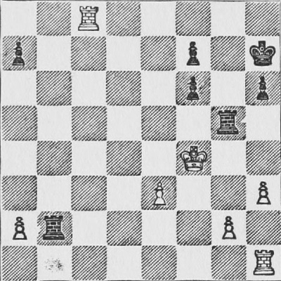

# Chessboard Diagram classifier

- [1. Introduction](#1-introduction)
- [2. Data](#2-data)
- [3. Feature Extraction](#3-feature-extraction)
- [4. Classifier](#4-classifier)
- [5. Performance](#5-performance)
- [6. Full Board Classification](#6-full-board-classification)
- [7. Overfitting](#7-overfitting)

## 1. Introduction

Goal of this classifier is to classify board positions from a classic chess book (Chess Fundamentals, José Raúl Capablanca (1921)).

This involves taking the diagram of the full board, cutting it into 64 separate squares and then working out what is on each square. The squares can either be empty or they can contain a piece. A piece is either a white or a black pawn, bishop, knight, rook, king or queen.

Run the train step

    python3 train.py

Then run the evaluation step

    python3 evaluate.py

## 2. Data

The task is not as straightforward as you might imagine because the mechanical printing process, used at the time of publication, produces images that have a lot variability (see Figure 1, below). <figure>
  

  <figcaption>Fig.1 - A diagram of a chessboard (left) and with added noise (right).</figcaption>
</figure>

To make the task more challenging:

  1. Classify given a dataset in which the images have been corrupted, i.e., by the addition of artificial noise.
  2. Classification system can use no more than 10 features to represent each square.

## 3. Feature Extraction 

Firstly I performed feature extraction by just reducing dimensionality using PCA to 10 dimensions by computing the covariance matrix on the train data and its eigenvectors matrix, finally applying linear transformation (y=Ax). I got good results 97.4% for clear data, and 89.9% for noisy data.

Then I wanted to improve by using divergence driven feature selection on top of PCA reduction. Started with reducing to PCA reduction to 50-d and then selecting requested 10 features. I've got working code but results were worse 93.9% for clear data and 84.9% for noisy data. I thought the problem was with PCA reduction bounded to too many dimensions, so I tried to decrease the number of dimensions, but it didn't help - no change in results. Then I tried with PCA reduction to 100 and 250, still results were below implementation using solely PCA to 10 dimensions. Finally I commented code out for additional feature selection, and stayed with using PCA reduction to 10 dimensional space because it produces the highest results.

## 4. Classifier 

Firstly I thought that a parameterized gaussian classifier is a desirable approach. Then I realised that in the problem domain there exist two clusters per label. Each square or chess piece is on white or black background. They are far apart in 2500-d space, so cannot assume that data is normally distributed. Constructing a proper parametrized classifier would require proper clustering to avoid big model error. Which is difficult to implement.

Easier approach is to use the nearest neighbor classifier (NNC). This works well because the difference between labels and it’s variances (white/black background) are very little. For example white queen on black square is the ones stored in train samples. There is enough data for each label variant (cluster), each black/white piece on black/white square for this to work well. (97.4% and 89.9%)

Having Implemented NNC I thought that natural continuation is k-NNC that considers k nearest neighbors and returns mode of their labels. Worked even better. (97.2% and 92.7%) for k=8. I experimented with different values for k, and turned out that 8 is the optimal. Results were worse for other k’s tested in range (1,20).

## 5. Performance

My percentage correctness scores (to 1 decimal place) for the development data are as follows.

Clean data:

- Square mode: 97.4%
- Board mode: 97.4%

Noisy data:

- Square mode: 89.9%
- Board mode: 89.9%

## 6 Full Board Classification

I was thinking about applying prior knowledge to the classifier. For example if White queen was classified then we can be sure that there can’t be any other one. Also there are more pawns than any other pieces. There are two knights, bishops and rooks but only one king and queen in the color. However, applying prior knowledge could be bad because this is an exercise textbook, with chess positions at different game stages so there could be less pawns and some pawns could be already promoted and end up having more queens. Therefore prior knowledge could be misleading. The only knowledge that could be extracted successfully is knowing already if the square to classify is white or black. But the nearest neighbour classifier has in memory samples of each chess piece on every background so I wouldn't make the difference.

## 7 Overfitting

Interesting was that, using 8-NNC results dropped slightly by 0.2% for clean data compared to just NNC, but for noisy data results were significantly improved by about 2.8%. This was all the time when testing different values for k. Propably due to overfitting and insufficient data set.
